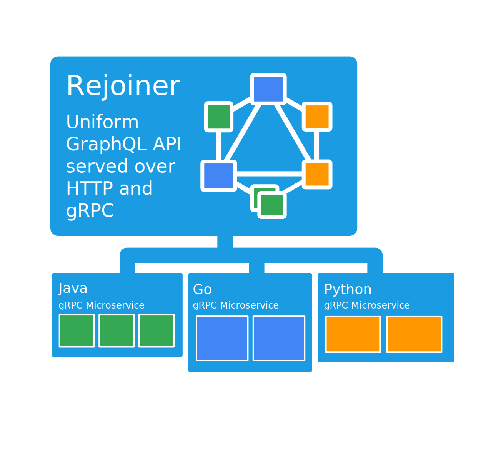
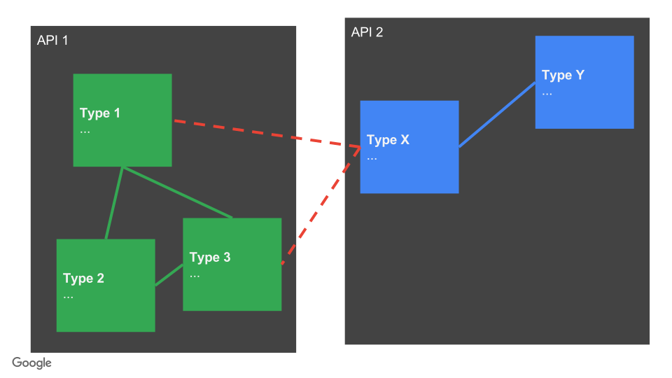

# Rejoiner

[](https://travis-ci.org/google/rejoiner)
[](https://coveralls.io/github/google/rejoiner?branch=master)
[](https://www.codacy.com/app/siderakis/rejoiner?utm_source=github.com&amp;utm_medium=referral&amp;utm_content=google/rejoiner&amp;utm_campaign=Badge_Grade)
[](http://mvnrepository.com/artifact/com.google.api.graphql/rejoiner/0.0.4)


 - Creates a uniform GraphQL schema from microservices
 - Allows the GraphQL schema to be flexibly defined and composed as shared components
 - Generates GraphQL types from Proto definitions
 - Populates request Proto based on GraphQL query parameters
 - Supplies a DSL to modify the generated schema
 - Joins data sources by annotating methods that fetch data
 - Creates Proto [FieldMasks](https://developers.google.com/protocol-buffers/docs/reference/java/com/google/protobuf/FieldMask) based on GraphQL selectors

 

## Experimental Features

These features are actively being developed.

 - Expose any GraphQL schema as a gRPC service.
 - Lossless end to end proto scalar types when using gRPC.
 - Relay support [[Example](examples-gradle/src/main/java/com/google/api/graphql/examples/library)]
 - GraphQL Stream (based on gRPC streaming) [[Example](examples-gradle/src/main/java/com/google/api/graphql/examples/streaming)]

## Schema Module

SchemaModule is a Guice module that is used to generate parts of a GraphQL
schema. It finds methods and fields that have Rejoiner annotations when it's
instantiated. It then looks at the parameters and return type of these methods
in order to generate the appropriate GraphQL schema. Examples of queries,
mutations, and schema modifications are presented below.

## GraphQL Query

```java
final class TodoQuerySchemaModule extends SchemaModule {
  @Query("listTodo")
  ListenableFuture<ListTodoResponse> listTodo(ListTodoRequest request, TodoService todoService) {
    return todoService.listTodo(request);
  }
}
```

In this example `request` is of type `ListTodoRequest` (a protobuf message), so
it's used as a parameter in the generated GraphQL query. `todoService` isn't a
protobuf message, so it's provided by the Guice injector.

This is useful for providing rpc services or database access objects for
fetching data. Authentication data can also be provided here.

Common implementations for these annotated methods:
 - Make gRPC calls to microservices which can be implemented in any language
 - Load protobuf messages directly from storage
 - Perform arbitrary logic to produce the result

## GraphQL Mutation

```java
final class TodoMutationSchemaModule extends SchemaModule {
  @Mutation("createTodo")
  ListenableFuture<Todo> createTodo(
      CreateTodoRequest request, TodoService todoService, @AuthenticatedUser String email) {
    return todoService.createTodo(request, email);
  }
}
```

## Adding edges between GraphQL types

In this example we are adding a reference to the User type on the Todo type.
```java
final class TodoToUserSchemaModule extends SchemaModule {
  @SchemaModification(addField = "creator", onType = Todo.class)
  ListenableFuture<User> todoCreatorToUser(UserService userService, Todo todo) {
    return userService.getUserByEmail(todo.getCreatorEmail());
  }
}
```
In this case the Todo parameter is the parent object which can be referenced to
get the creator's email.

This is how types are joined within and across APIs.



## Removing a field

```java
final class TodoModificationsSchemaModule extends SchemaModule {
  @SchemaModification
  TypeModification removePrivateTodoData =
      Type.find(Todo.getDescriptor()).removeField("privateTodoData");
}
```

## Building the GraphQL schema
```java
import com.google.api.graphql.rejoiner.SchemaProviderModule;

public final class TodoModule extends AbstractModule {
  @Override
  protected void configure() {
    // Guice module that provides the generated GraphQLSchema instance
    install(new SchemaProviderModule());

    // Install schema modules
    install(new TodoQuerySchemaModule());
    install(new TodoMutationSchemaModule());
    install(new TodoModificationsSchemaModule());
    install(new TodoToUserSchemaModule());
  }
}
```

## Getting started

### Dependency information

Apache Maven
```xml
<dependency>
    <groupId>com.google.api.graphql</groupId>
    <artifactId>rejoiner</artifactId>
    <version>0.0.4</version>
</dependency>
```

Gradle/Grails
`compile 'com.google.api.graphql:rejoiner:0.0.4'`

Scala SBT
`libraryDependencies += "com.google.api.graphql" % "rejoiner" % "0.0.4"`


## Supported return types

All generated proto messages extend `Message`.
 - Any subclass of `Message`
 - `ImmutableList<? extends Message>`
 - `ListenableFuture<? extends Message>`
 - `ListenableFuture<ImmutableList<? extends Message>>`

## Project information

 - Rejoiner is built on top of [GraphQL-Java](https://github.com/graphql-java/graphql-java) which provides the core
   GraphQL capabilities such as query parsing, validation, and execution.  
 - Java code is formatted using [google-java-format](https://github.com/google/google-java-format).
 - Note: This is not an official Google product.
